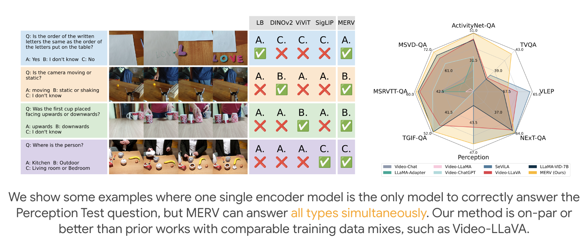

# Unifying Specialized Visual Encoders for Video Language Models (ICML 2025)

[](https://arxiv.org/abs/2501.01426)
[](https://tylerzhu.com/merv/)
[](https://pytorch.org/get-started/locally/)
[](https://www.python.org)

[**Installation**](#installation) | [**Quick Start**](#quick-start-for-inference) | [**Training**](#training) | [**Evaluation**](#evaluation)



This is an implementation of our method MERV, Multi-Encoder Representation of Videos.
We provide a simple and efficient codebase for training video-based large language models (VideoLLMs), particularly with multiple visual encoders for extracting visual information.

- **Different Visual Representations**. We natively support vision backbones such as
  [SigLIP](https://arxiv.org/abs/2303.15343), [DINOv2](https://arxiv.org/abs/2304.07193) as well as video backbones like
  [LanguageBind](https://arxiv.org/abs/2310.01852), [ViViT](https://arxiv.org/abs/2103.15691) – and even fusions of different backbones.
  Adding new backbones is easy via [TIMM](https://huggingface.co/timm) or Huggingface.
  Using multiple encoders is a first class feature, so it is easy to set different settings for different encoders (such as frame rates and so on).
- **Base and Instruct-Tuned Language Models**. We support arbitrary instances of `AutoModelForCausalLM` including both
  base and instruct-tuned models (with built-in prompt handling) via [Transformers](https://github.com/huggingface/transformers).
- **Fast, Efficient Training**. Our models are trained with PyTorch FSDP and Flash-Attention, making them very quick to train compared to other codebases. For example, in our testing, the Video-LLaVA codebase took ~80 hrs total to train a model which ours does in ~24 hrs. This also makes training on multiple visual encoders incur minimal overhead.

---

## Installation

This repository was built using Python 3.10, but should be backwards compatible with any Python >= 3.8. We require
PyTorch 2.1 or greater installation instructions [can be found here](https://pytorch.org/get-started/locally/). This
repository was developed and has been thoroughly tested with PyTorch 2.1.0, Torchvision 0.16.0, and Flash-Attention 2.3.3.

Once PyTorch has been properly installed, you can install this package locally via an editable installation.

```bash
git clone https://github.com/princetonvisualai/merv.git
cd merv
conda create -n merv python=3.10 -y
conda activate merv

pip install -e .

# Training additionally requires Flash-Attention 2 (https://github.com/Dao-AILab/flash-attention)
# Verify Ninja --> should return exit code "0"
ninja --version; echo $?

# Install Flash Attention 2
#   =>> If you run into difficulty, try `pip cache remove flash_attn` first
pip install flash-attn==2.5.9.post1 --no-build-isolation
```

Additionally, request access [here](https://huggingface.co/meta-llama/Llama-2-7b-hf) to use LLaMA-2 and generate an access token and put it in `.hf_token`

If you run into any problems during the installation process, please file a GitHub Issue.

## Quick Start for Inference

To run our models in inference, we suggest having at least 80GB of CPU memory and 24GB of GPU memory for inference. 
We have tested our model on a single RTX 3090.
See [```scripts/quick_start.py```](scripts/quick_start.py) for a simple example (shown below), and [```merv/models/registry.py```](merv/models/registry.py) for a list of available models: our two main models ```merv-frozen``` and ```merv-full```, as well as some single encoder baselines for testing.

```python
from pathlib import Path

import requests
import torch
from PIL import Image

from merv import load_vid

hf_token = Path(".hf_token").read_text().strip()
device = torch.device("cuda") if torch.cuda.is_available() else torch.device("cpu")

# Or a local path if models are locally downloaded
vidlm = load_vid("merv-full", hf_token=hf_token)
vidlm.to(device, dtype=torch.bfloat16)

# Run on example Perception Test video and specify a prompt
video_path = "./assets/video_10336_short.mp4"
user_prompt = "Describe what is happening in this video."

# Build prompt
prompt_builder = vidlm.get_prompt_builder()
prompt_builder.add_turn(role="human", message=user_prompt)
prompt_text = prompt_builder.get_prompt()

# Generate!
generated_text = vidlm.generate(
    video_path,
    prompt_text,
    num_frames=[16,16,32,16], # get from model config
    do_sample=True,
    temperature=0.4,
    max_new_tokens=512,
    min_length=1,
)
```

## Training

The training instruction is in [TRAINING.md](TRAINING.md)

## Evaluation

The evaulation instruction is in [EVALUATION.md](EVALUATION.md)

## Citation
If you find our work useful, please cite our paper.
```
@inproceedings{chung2025unifying,
      title={Unifying Specialized Visual Encoders for Video Language Models},
      author={Jihoon Chung and Tyler Zhu and Max Gonzalez Saez-Diez and Juan Carlos Niebles and Honglu Zhou and Olga Russakovsky},
      booktitle = {International Conference on Machine Learning (ICML)},
      year={2025},
}
```

Additionally, if this repository is useful, please also cite the original authors from Prismatic-VLMs who created this fantastic repository.
```
@inproceedings{karamcheti2024prismatic,
  title = {Prismatic VLMs: Investigating the Design Space of Visually-Conditioned Language Models},
  author = {Siddharth Karamcheti and Suraj Nair and Ashwin Balakrishna and Percy Liang and Thomas Kollar and Dorsa Sadigh},
  booktitle = {International Conference on Machine Learning (ICML)},
  year = {2024},
}
```
